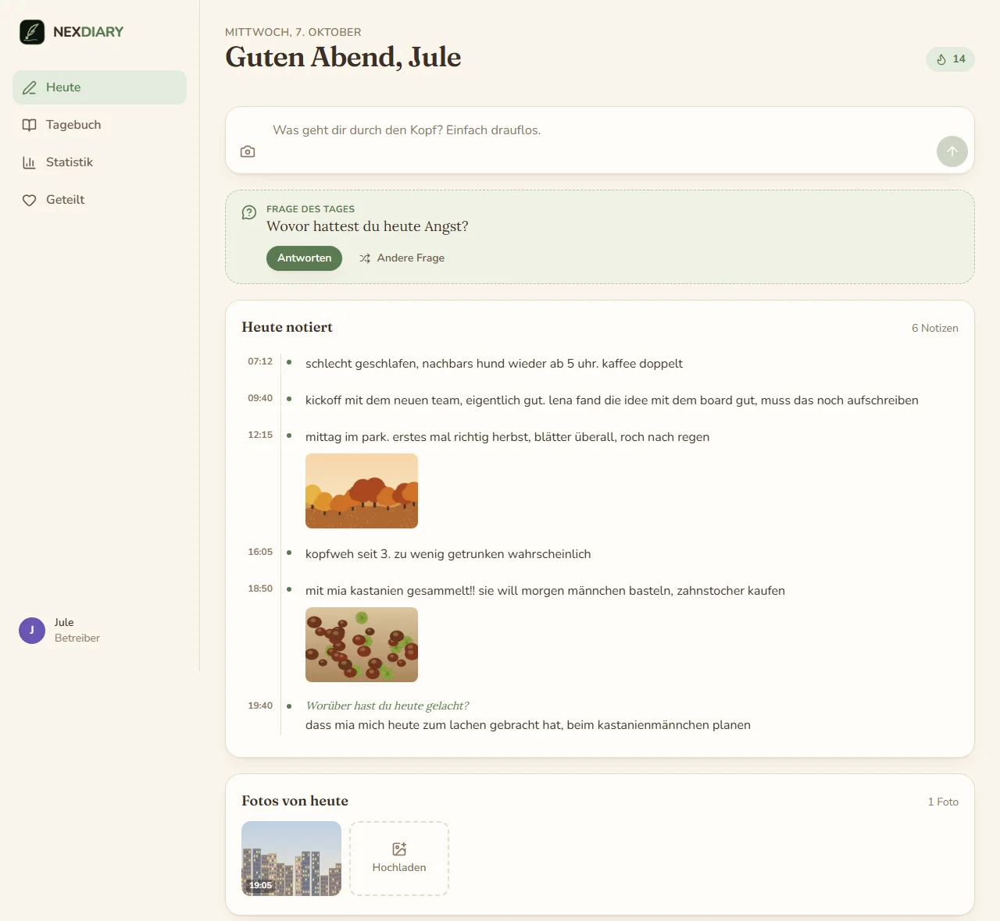
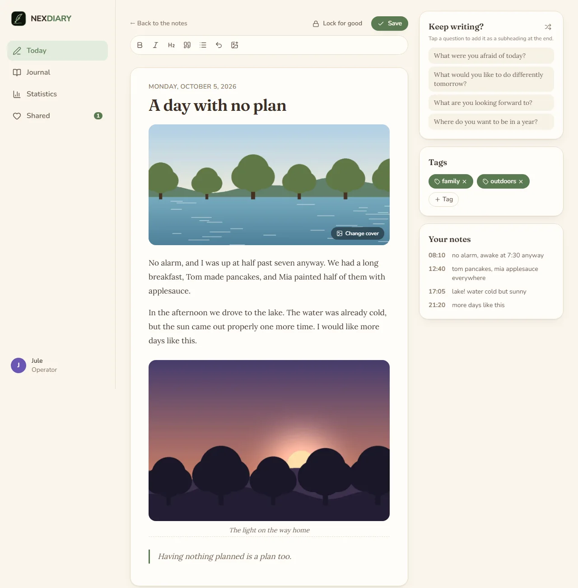
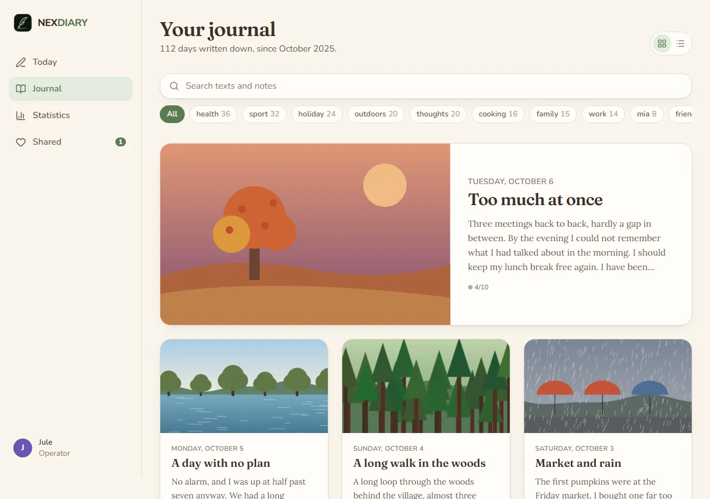
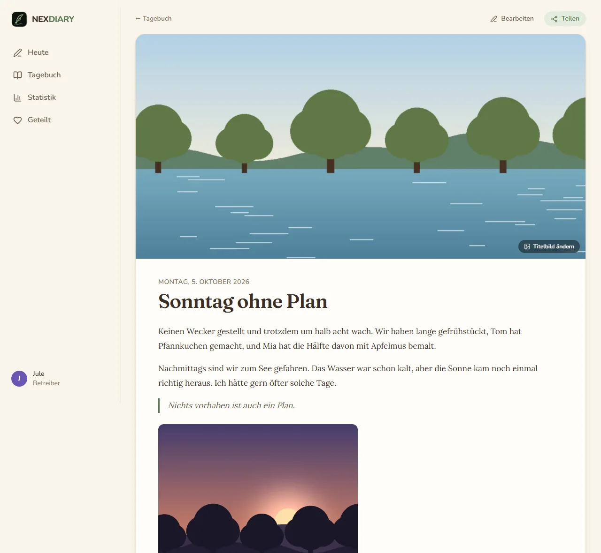
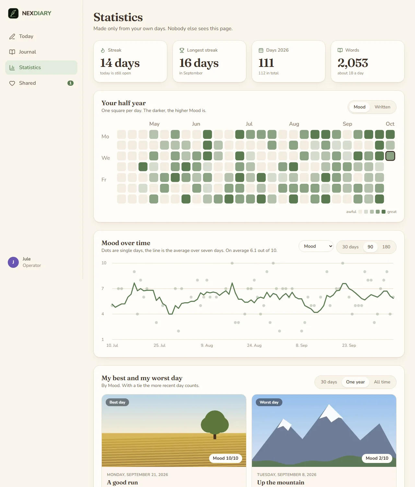
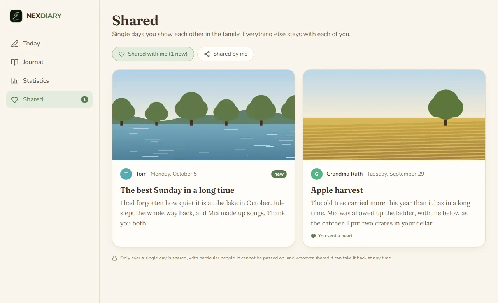
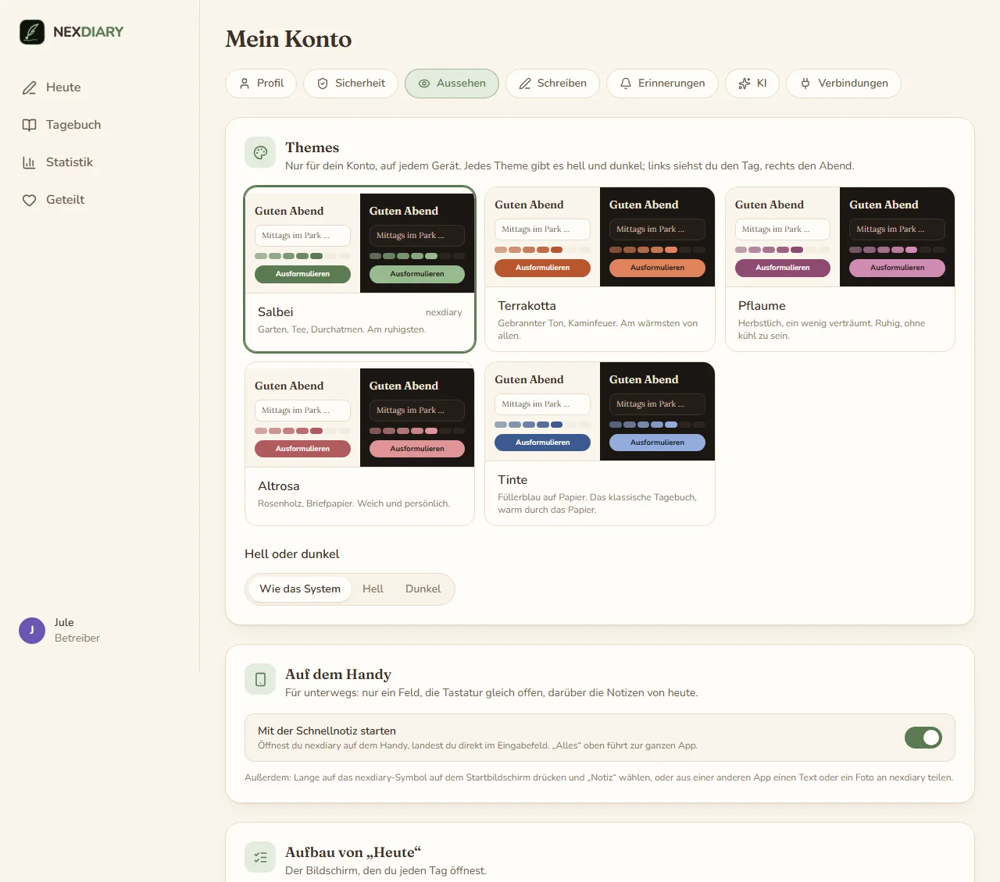
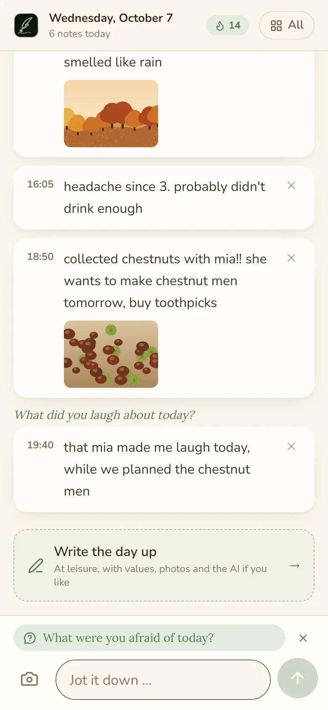

# nexdiary

A diary for the family, on your own server. Jot things down during the day without minding the spelling, and in the
evening turn them into a page: by yourself, or with an AI that only orders and smooths. Every person sees only their
own diary; single days can be shared with people of the family, and the operator manages the accounts without ever
seeing what is written in them.

nexdiary is one of the nex apps and looks like them: warm paper by day, candlelight by night, sage green (or four other
colours of your choice).



*"Today", in the layout of a single page. The notes of the day, the question of the day, the values of 1 to 10 and the
photos taken today; in the evening "Write up" turns them into a page.*

## Screenshots



*Writing a page. Every day has a cover picture, a photo of your own or one of 256 drawn illustrations; a suggestion by
season, time of day and tags is already chosen. The notes stay beside the page.*



*The journal as a blog, or as a timeline by month. Search covers pages and notes.*



*Reading a day. A day can be shared with chosen people of the family; they read it and may give a heart, nothing more.*



*Statistics, worked out on the server from your own days only: streaks, half a year as a calendar, a value over time with
its seven-day average, the best and the worst day, and what seems to go together (in sentences, with the reminder that
together does not mean because).*



*Shared with me, and what I have shared.*

<p>
  
  
</p>

*Five colours, each light and dark, kept with the account. On the phone the app starts on the quick note: one field with
the keyboard open, and the notes of today above it.*

More, in light and dark and on the phone, are in [docs/screenshots](docs/screenshots).

## What it does

- **Notes by day, a page in the evening.** Throw down what comes to mind, with the time it came. In the evening the
  notes become a page in the editor, written by yourself or suggested by the AI. The notes are never changed or lost.
- **A cover picture for every day.** Your own photo or one of 256 illustrations (16 motifs, four times of day, four
  seasons). A suggestion is already there, so a day is never without one.
- **Values from 1 to 10.** Mood, health, sleep, the working day, a relationship, and your own ones. Each person decides
  what they rate.
- **Writing prompts.** A question of the day for when nothing comes to mind, six groups that can each be switched off,
  and your own questions. A reminder may bring a question along.
- **Journal and search.** The days as a blog or as a timeline by month; tags; search over pages and notes.
- **Statistics.** Streaks, days in the year, words, half a year as a calendar, values over time, weekdays, what goes
  together, the best and the worst day (30 days, a year, ever), the most frequent tags, and the same day a year ago.
- **Sharing a day.** With chosen people of the family. They read the page and the photos; values and raw notes only if
  you tick them. A shared day is read-only and cannot be passed on; you take it back at any time. The only reaction is a
  heart.
- **Photos.** Upload them, or take them from your own [Immich](https://immich.app) (see below). Place and camera data
  are removed; every photo is drawn anew from its pixels and stored sealed.
- **On the phone.** All of it works on a phone. The quick note opens on a field and the keyboard; the app installs to the
  home screen with a shortcut "Note", and takes texts and photos shared from other apps.
- **Reminders** by Web Push, daily at your time or after a pause of a few days, not if you already wrote today.
- **Safe by default.** A second factor is required from the start, passkeys, a list of signed-in devices, a notice when
  somebody signs in from a new device, a brake against guessing, and everything you write is encrypted in the database.
- **Around it, as in the other nex apps.** Accounts by invitation, sign-in through an OpenID Connect provider (with a
  one-step setup for authentik), a log in four levels, German and English plus languages the operator adds as JSON
  files, backups with a check before going back, a page "About" that says when a new version is out.

## Start

```yaml
services:
  nexdiary:
    image: ghcr.io/derkezorm/nexdiary:latest
    container_name: nexdiary
    restart: unless-stopped
    ports:
      - "127.0.0.1:8550:8000"
    volumes:
      - ./data:/data
    environment:
      PUID: 1000
      PGID: 1000
      TZ: Europe/Berlin
```

```sh
docker compose up -d
```

Built from source instead: clone this repository, use `docker-compose.yml` as it is (it has `build: .`) and run
`docker compose up -d --build`. The file has every option explained.

Open `http://127.0.0.1:8550` on that machine (the port listens only there; the comment in
[docker-compose.yml](docker-compose.yml) says how to change that). The first account you create there is the operator.
It needs the **setup code** from the log, so that nobody who reaches a fresh instance first can take it:

```sh
docker logs nexdiary
```

shows the code, new at every start until nexdiary is set up. To choose it yourself, set `NEXDIARY_SETUP_TOKEN`. Right
after the password the account sets up its second factor; then the operator invites the others by link. Everything personal (colours, layouts, values, questions, reminders, Immich, tokens) is under "My account" for everybody; "Settings" is the operator's and holds the server.

## nexdiary on the internet

Many people will put nexdiary on the internet; it is made for that. Before you open it:

1. **Set it up first**, from your own network, with the setup code from the log. Only then forward a port.
2. **https at a reverse proxy**, and nexdiary reachable only through it: publish the port as `127.0.0.1:8550:8000` when
   the proxy runs on the same host, or keep both on a Docker network without a published port. Send HSTS from the proxy.
3. **Tell nexdiary about the proxy**: `NEXDIARY_PUBLIC_URL` (the address people use), `NEXDIARY_TRUSTED_PROXIES` (the
   proxy's address or network; without it every sign-in seems to come from the proxy and the brake against guessing
   cannot tell people apart) and `NEXDIARY_COOKIE_SECURE: "on"`.
4. **A second factor** is required from the start: right after the password every account sets one up (a code from an
   app, or a passkey) and keeps the recovery codes. The operator may switch the requirement off; do not.
5. **Look at "Ready for the internet?"** (Settings, Sign-in). It checks the points above for itself: https, the
   second factor, your own account with one, the brake, the encryption, the cookies and the proxy.
6. **Save the master key** (Settings, Backups, Encryption) and keep it apart from the backups. See below.
7. **Backups somewhere else**, as carefully as the data folder. A backup holds every account and the server's secrets
   (`secret.key`); try a restore with "Check" now and then.
8. **Leave the switches closed that you do not need**: API tokens, Immich and the AI are off until the operator opens
   them. Pin a version instead of `latest`, update on purpose, back up before.
9. Nobody, the operator included, sets a password for somebody else. Whoever forgot theirs gets a link to set a new
   one: the operator sends it (Settings, Accounts), or, where a mail server and the public address are set, the
   person asks for it on the sign-in page. The link works once and for 24 hours.
10. Passkeys work under the public https address, or on localhost.

Optionally keep the operator's settings at home: `NEXDIARY_OPERATOR_NETWORKS: "192.168.0.0/16"` refuses them from
anywhere else (behind a proxy only together with `NEXDIARY_TRUSTED_PROXIES`).

## Where things are stored

Everything lives in `/data`:

| Where | What |
|---|---|
| `nexdiary.db` | The SQLite database: accounts, days, notes, values, shares. What people write is sealed in it. |
| `media/` | Photos and their small pictures, each sealed in its own file. |
| `keys/master.key` | The master key, made at the first start (mode 0600). It wraps every person's data key. |
| `secret.key` | The server's own secret (the OIDC secret, the mail password and the like). |
| `backups/`, `logs/`, `locales/` | Backups, the log, extra languages as JSON files. |

Mount `/data` from a local disk, never from an SMB or NFS share: SQLite's locking does not work reliably over network
filesystems.

**What people write is encrypted in the database**: pages, notes, values, tags, photos and the Immich key. Each person
has a data key of their own, wrapped with the master key. That keeps a copy of the database or of a backup unreadable on
its own. The master key lies on the same machine, so this is no protection against somebody who owns the whole server;
it is meant for the copies that leave it.

**A backup cannot be read without the master key**, and the master key is never part of a backup. Settings, Backups,
Encryption downloads it (it asks for your password). Keep that file somewhere else than the backups, as
carefully as a password. Lose it and every backup is only ciphertext; so is the live database if the key file is gone.

A backup is one ZIP file with the database and the media files, made while nexdiary runs. Moving to a new server:
download a backup and the master key, set up nexdiary there with the key in `keys/master.key`, upload the backup under
Settings, Backups, check it and restore it.

## Updating

With an image: `docker compose pull && docker compose up -d`. Built from source: pull the new code and run
`docker compose up -d --build`. nexdiary adds what the database lacks at the start and makes a backup first; nothing
needs doing by hand. The way back is under Settings, Backups.

## Environment

| Variable | Default | Meaning |
|---|---|---|
| `NEXDIARY_DATA_DIR` | `/data` | Database, logs, backups, keys and the languages |
| `NEXDIARY_MEDIA_DIR` | `<data>/media` | The photos |
| `NEXDIARY_LOCALES_DIR` | `<data>/locales` | Extra languages, one JSON file each |
| `NEXDIARY_MASTER_KEY_FILE` | `<data>/keys/master.key` | Where the master key lies; keep it outside the backups |
| `NEXDIARY_SECRET_KEY` | made on first start | Protects server-side secrets; when set, it wins over `secret.key` |
| `NEXDIARY_PUBLIC_URL` | from the request | The address people use, for invitation links and the OIDC redirect. The setting in the interface wins |
| `NEXDIARY_TRUSTED_PROXIES` | none | Addresses or networks of reverse proxies whose `X-Forwarded-For` is believed, comma separated |
| `NEXDIARY_SETUP_TOKEN` | made at start | The code the first account needs |
| `NEXDIARY_OPERATOR_NETWORKS` | none | Networks the operator's settings may be changed from, comma separated |
| `NEXDIARY_SESSION_DAYS` | `30` | A session of "stay signed in on this device" ends after this many days without use |
| `NEXDIARY_COOKIE_SECURE` | `auto` | `on`, `off` or `auto` (from the request or `X-Forwarded-Proto`) |
| `NEXDIARY_COOKIE_SUFFIX` | none | Appended to the cookie names; keeps two instances on one host apart |
| `NEXDIARY_LOG_LEVEL` | stored setting | `quiet`, `normal`, `detailed` or `trace`; overrides the setting |
| `NEXDIARY_API_DOCS` | `false` | Serves `/api/docs` and `/api/openapi.json` |
| `NEXDIARY_DECODE_SLOTS` | `1` | How many pictures are unpacked at the same moment (each takes some 150 MB while open) |
| `NEXDIARY_UPDATE_URL` | GitHub | Where the update check asks for the newest release |
| `NEXDIARY_ARGON2_TIME`, `NEXDIARY_ARGON2_MEMORY_KIB`, `NEXDIARY_ARGON2_PARALLELISM` | `3`, `65536`, `2` | Cost of the password hash; only the tests lower it |
| `NEXDIARY_FRONTEND_DIST` | `/app/static` | Where the built interface lies (set by the image) |
| `NEXDIARY_DISABLE_BACKGROUND` | `false` | Switches off the background jobs (reminders, backups, update check); for tests |
| `NEXDIARY_PORT` | `8000` | The port inside the container; only for host networking |
| `PUID`, `PGID` | `1000` | Owner of the files in the data directory |
| `TZ` | | The time zone of the container's log. People's own time zones come from their browsers |

## AI

The AI is off until the operator chooses a service, for everybody (Settings, AI): none, a **local model** in
your own network (Ollama or anything that speaks `/v1/chat/completions`), a service on the internet that speaks the same,
or one that speaks the Messages API. Every person can switch it off for their account.

- Nothing is sent without a press of the button "Write up", and nothing on a schedule.
- What goes out are the notes of that one day, with their times and the questions they answer. No name, no date, no
  photos, no values.
- Before the button it says where the notes go: they stay at home, or the provider is named.
- The AI orders and smooths, writes in the first person, short or long, and invents nothing. Its suggestion is only a
  suggestion in the editor; the notes are never changed.
- A local service must lie in your own network and a service on the internet must be reached over https: an address
  that points elsewhere is refused, when it is saved and at every request. The API key is sealed and never shown again.

## Immich

Photos can come from your own Immich. The operator opens this first (Settings, Immich, closed from the start)
and names the hosts that may be reached. Each person then connects their own: the address and an API key with the
permissions `asset.read`, `asset.view` and `asset.download`. "Today" suggests the photos taken that day; a photo is
copied into nexdiary only when you take it. The browser never talks to Immich: the small pictures come through
nexdiary. Videos are left out.

## Push

Reminders and the notice of a new sign-in arrive by Web Push, to every device a person signs up
(My account, Reminders). It needs https (or localhost). On an iPhone it works only for the app added to the home
screen (Share, Add to Home Screen) and only from iOS 16.4. The server makes its own keys; the operator can add a contact
and further push services. A push never carries anything written in the diary.

## For programs

Dashboards and scripts can read the version and the name of a token's account with an API token. Off until the
operator switches it on; every account then makes its own tokens. Reading only. The routes are in
[docs/api.md](docs/api.md).

## Security in short

- Passwords are hashed with Argon2id. Five failed sign-ins lock an account and an address for 15 minutes; with a second
  factor, the password alone opens nothing. A session ends after 30 days without use, or after 12 hours when "stay signed
  in" was not ticked, and every device can be signed out on its own.
- Rights are checked on the server for every request: a person's days, notes, values and photos are theirs alone, and a
  day of somebody else opens only when it was shared with you. The operator manages accounts and never gets to entries.
- Pages, notes, values, tags, photos and keys are encrypted with a key of each person.
- Photos are drawn anew from their pixels (no metadata, no embedded code); pictures of more than 36 million pixels are
  refused before they are decoded; the storage per person is limited.
- Every changing request needs a header a page on another site cannot send. Cookies are `HttpOnly` and `SameSite`; the
  Content Security Policy only allows the app's own files.
- Addresses the server reaches out to (the AI, Immich, push services) are checked against the internet and the home
  network: resolved once, connected to exactly as checked, no redirect followed, never a metadata address.
- The log never contains a word of a page or a note, passwords, keys or tokens.

How to report a problem: [SECURITY.md](SECURITY.md).

## Development

```sh
cd backend && python -m venv .venv && .venv/Scripts/python -m pip install -r requirements-dev.txt
.venv/Scripts/python -m pytest -q
.venv/Scripts/python -m uvicorn app.main:app --port 8550 --no-proxy-headers --no-server-header
cd frontend && npm ci && npm run dev && npm test && npm run lint && npm run build
```

On Linux the virtual environment's programs are in `.venv/bin`. The frontend on port 5550 sends `/api` to the backend.
The tests need no network and keep their data in a folder of their own.

## License

[AGPL-3.0](LICENSE).

The icons are [Lucide](https://lucide.dev) (ISC, partly MIT from Feather); the fonts are Fraunces, Lora and Nunito
(OFL-1.1). Their notices ship with the app at `/licenses/`. Everything else nexdiary ships or depends on, with its
licence, is listed in [THIRD-PARTY.md](THIRD-PARTY.md).
